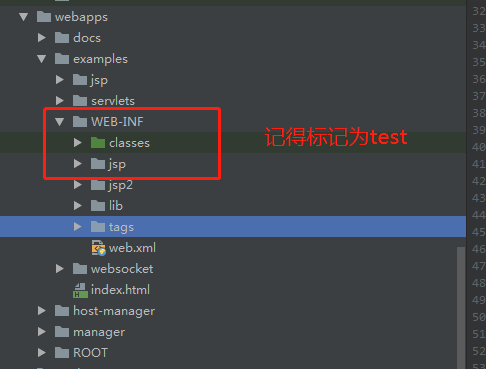

## 欢迎一起来阅读 Apache Tomcat 源码！

### 描述

本源码基于 Tomcat 9，用于添加相关中文注释，便于读者理解。

### 配置环境

test不能使用解决方案。



### vm 参数配置

```
-Dcatalina.home=D:\open-source\tomcat -Dcatalina.base=D:\open-source\tomcat -Djava.endorsed.dirs=D:\open-source\tomcat\endorsed -Djava.io.tmpdir=D:\open-source\tomcat\temp -Djava.util.logging.manager=org.apache.juli.ClassLoaderLogManager -Djava.util.logging.config.file=D:\open-source\tomcat\conf\logging.properties -Djava.protocol.handler.pkgs=org.apache.catalina.webresources -Djdk.tls.ephemeralDHKeySize=2048
```

### 不能编译问题解决方案

org.apache.catalina.startup.ContextConfig

```
protected synchronized void configureStart() {
    //解决无法编译JSP：手动将JSP解析器初始化
    context.addServletContainerInitializer(new JasperInitializer(), null);
}
```

### 怎么打印调用堆栈信息

org.apache.catalina.core.ContainerBase

```
@Override
protected void initInternal() throws LifecycleException {
    reconfigureStartStopExecutor(getStartStopThreadsInternal());
    printStackInfo();
    super.initInternal();
}

 /**
 * 打印栈信息(供测试使用)
 */
protected void printStackInfo(){
    Throwable throwable = new Throwable();
    for (StackTraceElement element : throwable.getStackTrace()) {
        System.out.print(element.getClassName() + "\t");
        System.out.print(element.getMethodName() + "\t");
        System.out.print(element.getFileName() + "\t");
        System.out.println(element.getLineNumber());
    }
}
```
